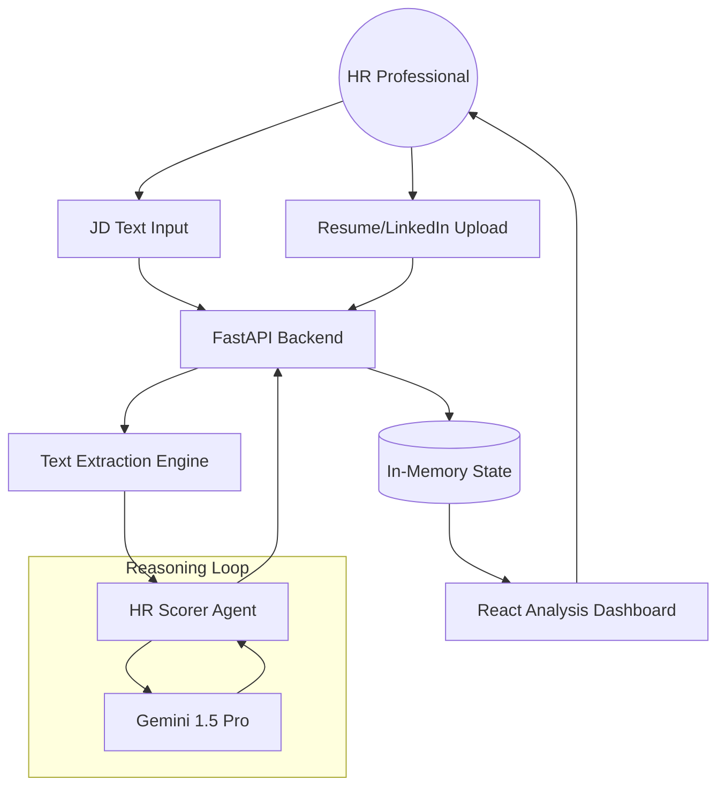

# 🎯 Antigravity HR: AI Talent Agent

A premium, enterprise-grade AI HR agent that automates the candidate screening process with precision and transparency. This system evaluates candidates against 5 key dimensions using state-of-the-art LLMs, providing a structured and explainable shortlisting experience.

---

## 🏗️ Agent Architecture



---

## 🚀 Features

- **JD Intelligence**: Automatically extracts skills, experience years, and domain requirements.
- **Multimodal Ingestion**: Supports PDF, DOCX, and LinkedIn JSON scraper data.
- **5-Dimension Rubric**:
  - **Skills Match (30%)**: Technical alignment.
  - **Experience Relevance (25%)**: Professional seniority and domain fit.
  - **Education & Certs (15%)**: Academic and certification verification.
  - **Project/Portfolio (20%)**: Evidence of practical application.
  - **Communication (10%)**: Clarity and structure of the profile.
- **Human-in-the-Loop**: Integrated mechanism for administrative score overrides with audit logging.
- **Monochrome Premium UI**: Clean, high-contrast dashboard with real-time semantic scoring feedback.

---

## 🛠️ Technology Rationale

### **LLM: Google Gemini 1.5 Pro / Flash**
- **Rationale**: Chosen for its industry-leading **context window** and native **JSON mode** capabilities. It excels at extracting structured data from messy resume formats without losing semantic nuance.
- **Fallback**: The system includes a smart fallback to `Gemini 1.5 Flash` for faster, cost-effective batch processing of large candidate pools.

### **Framework: FastAPI & LangChain**
- **Rationale**: 
  - **FastAPI**: Provides high-performance, asynchronous endpoints critical for handling concurrent LLM calls. Pydantic integration ensures strict data validation.
  - **LangChain**: Simplifies the orchestration of LLM chains, particularly for structured output parsing via `PydanticOutputParser`.

### **Frontend: React + Framer Motion**
- **Rationale**: Enables a fluid, "live" feel. Framer Motion handles the micro-animations that signify AI reasoning as candidates are processed.

---

## 🔒 Security & Privacy Mitigations

1. **Environment Isolation**: All sensitive credentials (GOOGLE_API_KEY) are managed via `.env` files and never exposed to the client.
2. **Data Sanitization**: Pydantic models strictly validate all LLM outputs to prevent injection attacks or malformed data processing.
3. **Ephemeral Storage**: Uploaded resumes are stored in a gated `temp_uploads` directory (or `/tmp` in production) and are not persisted beyond the analysis session.
4. **CORS Enforcement**: Backend strictly defines allowed origins to prevent unauthorized cross-site requests in production.

---

## 🏃 Getting Started

### 1. Prerequisites
- Python 3.9+
- Node.js 18+
- Google Gemini API Key

### 2. Backend Setup
1. Navigate to the backend folder and create a `.env` file:
   ```env
   GOOGLE_API_KEY=your_key_here
   MODEL_NAME=gemini-1.5-flash
   ```
2. Install dependencies:
   ```bash
   pip install -r backend/requirements.txt
   ```
3. Start the server:
   ```bash
   python backend/main.py
   ```

### 3. Frontend Setup
1. Navigate to the frontend folder and install dependencies:
   ```bash
   npm install
   ```
2. Start the development server:
   ```bash
   npm run dev
   ```

### 4. Smart Deployment
The application automatically detects its environment. On `localhost`, it connects to the local backend; when deployed, it dynamically connects to the production URL configured in your environment variables.

---

## 📄 License
MIT © 2026 Antigravity AI Team
